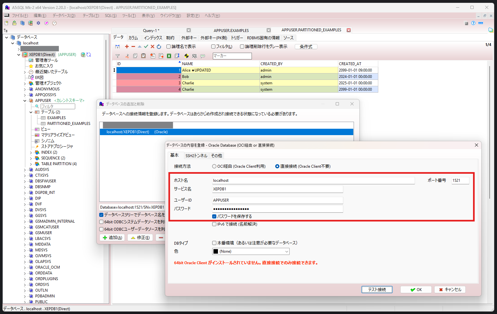

<!-- omit in toc -->
# Practice - Oracle Database

<!-- omit in toc -->
## TOC

- [Setup](#setup)
    - [Start up database](#start-up-database)
    - [Create first user and sample data](#create-first-user-and-sample-data)
- [Memos](#memos)
    - [Log in with sqlplus on Docker Compose](#log-in-with-sqlplus-on-docker-compose)
    - [Log in with A5:SQL Mk-2](#log-in-with-a5sql-mk-2)
- [License](#license)
- [References](#references)

## Setup

### Start up database

```sh
# Clone
git clone https://github.com/kem198/practice-oracle-db.git
cd practice-oracle-db

# (Optional) Change password for admin users (sys, system, pdbadmin)
# Change the value of `ORACLE_PWD=admin_password`
#                                 ^^^^^^^^^^^^^^
vim docker-compose.yml

# (Optional) Change password for application user (APPUSER)
# Change the value of `CREATE USER APPUSER IDENTIFIED BY appuser_password;`
#                                                        ^^^^^^^^^^^^^^^^
vim script/setup/01_create_appuser.sql

# Start service
docker compose up -d
```

### Create first user and sample data

> [!NOTE]
> Please use the following steps to create the `APPUSER` and sample data, because migration did not work as expected when following the references.

1. Log in as the system user:

    ```shell
    docker compose exec db sqlplus system/admin_password@XEPDB1
    ```

2. Execute the following script to create `APPUSER` :

    ```sql
    @/opt/oracle/scripts/setup/01_create_appuser.sql
    ```

3. Type `exit` to log out, then log in as `APPUSER` :

    ```sql:aaa
    exit
    ```

    ```shell
    docker compose exec db sqlplus APPUSER/appuser_password@XEPDB1
    ```

4. Execute the following script to create tables and insert sample data:

    ```sql
    @/opt/oracle/scripts/setup/02_create_appuser_examples.sql
    ```

You can now run queries and practice as a regular application user.

## Memos

### Log in with sqlplus on Docker Compose

```sh
docker compose exec db sqlplus sys/admin_password@XEPDB1 as sysdba
docker compose exec db sqlplus system/admin_password@XEPDB1
docker compose exec db sqlplus pdbadmin/admin_password@XEPDB1
docker compose exec db sqlplus APPUSER/appuser_password@XEPDB1
```

### Log in with [A5:SQL Mk-2](https://a5m2.mmatsubara.com/)

log in as `APPUSER` :



## License

This repository uses [Oracle Database XE](https://www.oracle.com/jp/database/technologies/appdev/xe.html) under the [Oracle Free Use Terms and Conditions](https://www.oracle.com/downloads/licenses/oracle-free-license.html).

The full license text is available in the [LICENSE](./LICENSE) file.

## References

- [Oracle Database Express Edition - Repository Detail](https://container-registry.oracle.com/ords/f?p=113:4:5050694688007:::4:P4_REPOSITORY,AI_REPOSITORY,AI_REPOSITORY_NAME,P4_REPOSITORY_NAME,P4_EULA_ID,P4_BUSINESS_AREA_ID:803,803,Oracle%20Database%20Express%20Edition,Oracle%20Database%20Express%20Edition,1,0&cs=3oQDD5bKN0uKPlM4cbUTplI8klg4dSyCU7vkE8T1UVokexF9WHn2wR6xE1Z5i7W50TlQ3xq-2irOUPwTlyE3onA)
- [Oracle Container Registryを使ってOracle製品をDocker環境で動かしてみる \#oracle - Qiita](https://qiita.com/charon/items/44624e2cdf21449769cf)
- [【Docker】Oracleを無料で簡単にローカルに構築する](https://zenn.dev/re24_1986/articles/29430f2f8b4b46)
